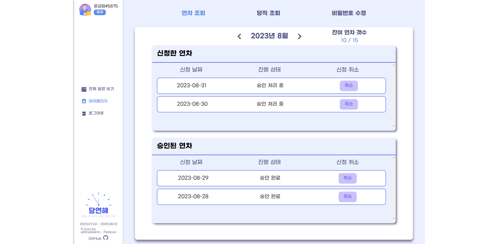
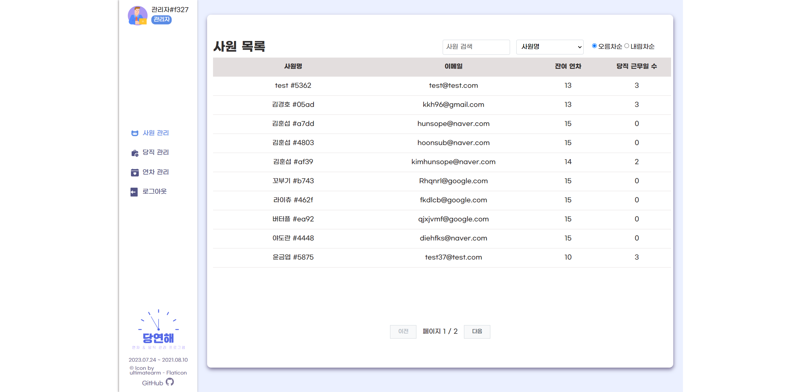

# 📑 당연해 (DangYeonHae)

<p>React, TypeScript, Rest API를 활용한 연차 / 당직 관리 웹사이트 입니다.</p>

## 📌 프로젝트 소개

> **패스트캠퍼스 프론트엔드 개발 부트캠프 5기**<br />
> **개발 기간** : 2023. 07. 24 ~ 2023. 08. 10<br />
> **배포 주소** : [당연해](https://dangyeonhae.netlify.app/)<br />
> **프론트엔드 레포지토리** : [프론트엔드](https://github.com/FAST-Mini-Project/front-end)<br />
> **백엔드 레포지토리** : [백엔드](https://github.com/FAST-Mini-Project/back-end)
<br />

## 📌 개발 팀원 및 역할

| <a href="https://github.com/ruddnjs3769"></a> | <a href="https://github.com/hwanginseung"></a> | <a href="https://github.com/DevYBecca"></a> | 
| :----------------------------------------------------------------------------------------------------------------------------------: | :-----------------------------------------------------------------------------------------------------------------------------------: | :-------------------------------------------------------------------------------------------------------------------------------------: | 
|                                                 [김경원](https://github.com/ruddnjs3769)                                                  |                                                 [황인승](https://github.com/hwanginseung)                                                  |                                                 [윤금엽](https://github.com/DevYBecca)
|                                                          GitHub 팀장<br /> 초기 개발 세팅<br /> 메인 페이지<br /> 로그인, 회원가입, 로그아웃<br /> Header                                                       |                                                        관리자 페이지<br /> (사원 관리, 연차 관리, 당직 관리)                                                          |                                                            마이 페이지<br /> (연차 조회, 당직 조회, 비밀번호 수정)                                                             

## 📌 사용 기술 및 개발 환경

### Development

<p>


<br />


</p>

### Config

<p>
</a>
</a>
</p>

### Deployment

</a>

### Environment

<p>
</a>
</a>
</a>
</p>

### Cowork Tools
<p>


</p>

<br />

## 📌 프로젝트 테스트

### clone project

```bash
$ git clone https://github.com/FAST-Mini-Project/front-end.git
```

### install npm

```bash
$ npm install
```

### start project

```bash
$ npm run dev
```

<br />


## 📌 프로젝트 상세 기능

### 1️⃣ 메인 페이지

#### HEADER
+ 유저 정보 + #사원번호 표시
+ NAVBAR 이용하여 메인/마이페이지/로그아웃 연결
+ 프로젝트 정보 및 저작권 정보 표시
#### Calendar
+ Fullcalendar 라이브러리 이용
+ 월 별 일정 조회 가능
+ 전체 연차 / 당직 일정 조회 : 모든 사원의 연차 / 당직 일정 조회 가능
+ 내 연차 / 당직 일정 조회 : 나의 연차 신청 현황 및 당직 일정 조회 가능
+ 연차 신청 : 날짜 클릭 시 모달 창 나타나며 해당 일자에 연차 신청 가능

#### Login / SignUp
+ 이메일, 비밀번호 입력 시 유효성 검사(이메일 형식(example@example.com), 비밀번호 형식(8자리 이상))
+ 유효성 검사 통과 못할 시 로그인 / 회원가입 버튼 비활성화
+ 회원가입 성공 시 로그인 페이지로 이동
+ 로그인 성공 시 관리자는 관리자 페이지, 일반사원은 메인페이지로 이동

### 2️⃣ 마이 페이지
- 연차 조회, 당직 조회, 비밀번호 수정 탭 메뉴 전환
#### 연차 조회
- 신청한 연차, 승인된 연차 조회 : 선택한 년도와 월에 따라 필터링  
  - 연차 신청 날짜가 오늘이 지나면 취소 버튼 비활성화(hover시 설명 출력)
- 년도에 맞게 잔여 연차 갯수 출력 : 신청, 승인 연차 갯수를 카운트하여 차감  
  - 년도가 변경될 경우 잔여 연차 갯수도 초기화(신청, 승인 연차가 있을 경우 계산 반영)
- 신청한 연차 리스트에서 취소 버튼 클릭 : 즉시 연차 신청 취소
- 승인된 연차 리스트에서 취소 버튼 클릭 : 관리자에게 연차 취소 신청 전달   
  - 관리자 승인을 거쳐야만 연차 취소가 완료됨

#### 당직 조회
- 예정된, 완료된 당직 조회 : 선택한 년도와 월에 따라 필터링
- 예정된 당직 일정과 완료한 당직 일정 분류 : 오늘 날짜가 지나면 완료 일정으로 자동 이동  
  - 완료된 당직 일정은 비활성화(hover시 설명 출력)
#### 비밀번호 수정
- 현재 비밀번호, 새 비밀번호, 새 비밀번호 확인 입력 필요
- 새 비밀번호와 새 비밀번호 확인이 일치해야만 비밀번호 수정 가능
- 비밀번호 수정 완료 시 로그인 페이지로 이동  
  - 다시 로그인해서 token을 받아야 함
- 유효성 검사
  - 수정 요청을 한 사원의 email 형식
  - 비밀번호는 8자리 이상 입력해야 함
### 3️⃣ 관리자 페이지
+ 관리자 아이디 외 접근불가 
 - 접근시 로그인 페이지로 이동
  
#### 사원 관리
+ 사내 모든 사원 리스트 출력
+ 사원명, 이메일, 잔여 연차, 당직 근무일 수 출력
+ 사원명 검색 기능
+ 사원명, 잔여 연차, 당직 근무일 수로 정렬 가능
+ 10명씩 pagenation
  
#### 당직 관리
+ 당직 근무자 캘린더 형식으로 출력
+ 달력 일일 칸에 근무자 출력, 근무 취소 기능
+ 해당 일 클릭시, 당직 근무자 설정 가능
+ 오늘 이전 날짜의 당직 근무자는 변경 불가능
  
#### 연차 관리
+ 연차 신청 목록, 취소 신청 목록 2가지 목록 출력
+ 연차 신청 목록 
  - 연차를 신청한 사원명, 연차 날짜 출력, 관리자가 연차의 승인/거부 가능
+ 취소 신청 목록 
  - 승인된 연차를 사원이 변경 신청을 한 경우 
    사원명, 연차 날짜 출력, 관리자가 취소신청의 승인/거부 가능
+ 사원명 검색 기능
+ 사원명, 날짜별 정렬 기능


### 기타 기능
+ uuid 사용하여 중복 없는 사원번호 생성
+ 일반 유저 또는 로그인 정보 없을 때 admin 페이지 접근 불가(PrivateRoute)
+ 로그인 정보 없을 때 main/mypage 접근 불가

## 📌 프로젝트 구조
<details>
  <summary>보기</summary>

  ```
📦 DangYeonHae
├─ .eslintrc.cjs
├─ .gitignore
├─ .prettierignore
├─ .prettierrc
├─ index.html
├─ package-lock.json
├─ package.json
├─ public
│  ├─ favicon.ico
│  ├─ free-icon-calendar-2738431.png
│  ├─ free-icon-employee-3043585.png
│  ├─ logo.png
│  └─ readme
│     ├─ admin_annuals.png
│     ├─ admin_duties.png
│     ├─ admin_dutymodal.png
│     ├─ admin_users.png
│     ├─ login.png
│     ├─ main_all.png
│     ├─ main_annualmodal.png
│     ├─ main_personal.png
│     ├─ mypage_annual.png
│     ├─ mypage_duty.png
│     └─ mypage_info.png
├─ readme.md
├─ src
│  ├─ App.tsx
│  ├─ _variables.scss
│  ├─ api
│  │  ├─ admin
│  │  │  └─ index.ts
│  │  ├─ index.ts
│  │  ├─ main
│  │  │  └─ index.ts
│  │  ├─ mypage
│  │  │  └─ index.ts
│  │  └─ user
│  │     └─ index.ts
│  ├─ components
│  │  ├─ adminfilter
│  │  │  ├─ AdminFilter.tsx
│  │  │  └─ AdminFilters.module.scss
│  │  ├─ adminwork
│  │  │  ├─ AdminWork.module.scss
│  │  │  └─ AdminWork.tsx
│  │  ├─ common
│  │  │  ├─ MainHeader.module.scss
│  │  │  └─ MainHeader.tsx
│  │  ├─ loginSignupRegex
│  │  │  ├─ regexValid.module.scss
│  │  │  └─ regexValid.tsx
│  │  ├─ main
│  │  │  ├─ AnnualApplyModal.module.scss
│  │  │  ├─ AnnualApplyModal.tsx
│  │  │  ├─ CalendarForm.module.scss
│  │  │  └─ CalendarForm.tsx
│  │  ├─ mypage
│  │  │  ├─ ApprovedAnnual.module.scss
│  │  │  ├─ ApprovedAnnual.tsx
│  │  │  ├─ CompletedDutyList.module.scss
│  │  │  ├─ CompletedDutyList.tsx
│  │  │  ├─ MenuTab.module.scss
│  │  │  ├─ MenuTab.tsx
│  │  │  ├─ MonthRange.module.scss
│  │  │  ├─ MonthRange.tsx
│  │  │  ├─ PlannedDutyList.module.scss
│  │  │  ├─ PlannedDutyList.tsx
│  │  │  ├─ RemainingAnnual.module.scss
│  │  │  ├─ RemainingAnnual.tsx
│  │  │  ├─ RequestedAnnual.module.scss
│  │  │  └─ RequestedAnnual.tsx
│  │  ├─ pagination
│  │  │  ├─ Pagination.module.scss
│  │  │  └─ Pagination.tsx
│  │  └─ sidebar
│  │     ├─ SideBar.module.scss
│  │     └─ SideBar.tsx
│  ├─ custom.d.ts
│  ├─ index.scss
│  ├─ index.tsx
│  ├─ layout
│  │  ├─ AdminLayout.tsx
│  │  ├─ AdminPrivateRouteWrapper.tsx
│  │  ├─ MainLayout.module.scss
│  │  └─ MainLayout.tsx
│  ├─ pages
│  │  ├─ admin
│  │  │  ├─ AdminAnnual.module.scss
│  │  │  ├─ AdminAnnual.tsx
│  │  │  ├─ AdminDuty.module.scss
│  │  │  ├─ AdminDuty.tsx
│  │  │  ├─ AdminEmployee.module.scss
│  │  │  └─ AdminEmployee.tsx
│  │  ├─ login
│  │  │  ├─ LogIn.module.scss
│  │  │  ├─ LogIn.tsx
│  │  │  ├─ SignUp.module.scss
│  │  │  └─ SignUp.tsx
│  │  ├─ main
│  │  │  ├─ Main.module.scss
│  │  │  └─ Main.tsx
│  │  └─ mypage
│  │     ├─ MyAnnual.module.scss
│  │     ├─ MyAnnual.tsx
│  │     ├─ MyDuty.module.scss
│  │     ├─ MyDuty.tsx
│  │     ├─ MyInfo.module.scss
│  │     ├─ MyInfo.tsx
│  │     ├─ MyPage.module.scss
│  │     └─ Mypage.tsx
│  ├─ types
│  │  ├─ AccessTypes.ts
│  │  ├─ AdminTypes.ts
│  │  ├─ MainTypes.ts
│  │  └─ MypageTypes.ts
│  ├─ utils
│  │  ├─ SortedData.ts
│  │  ├─ UserPrivateRoute.tsx
│  │  ├─ constants
│  │  │  └─ regex.ts
│  │  ├─ cookie.ts
│  │  └─ handleLogout.ts
│  └─ vite-env.d.ts
├─ tsconfig.json
├─ tsconfig.node.json
└─ vite.config.ts
```
</details>


## 📌 구현 화면
| 로그인 페이지 | 메인 페이지(전체 연차/당직 조회) |
| ------------------ | -------------------- |
|           |             |

| 메인 페이지(개인 연차/당직 조회) | 메인 페이지(연차 신청) |
| ----------------------------- | ------------------------------- |
|                      |                        |

| 마이 페이지(연차 조회) | 마이 페이지(당직 조회) |
| ----------------------------- | ------------------------------- |
|                      |                        |

| 마이 페이지(비밀번호 수정) | 관리자 페이지(사원 관리) |
| ------------------- | --------------------- |
|            |              |

| 관리자 페이지(당직 관리) | 관리자 페이지(당직 지정) |
| ------------------- | --------------------- |
|            |              |

| 관리자 페이지(연차 관리) |
| ------------------- | 
|            |

<br />

## 📌 담당 페이지 및 기능 구현

### 마이 페이지(연차 조회, 당직 조회, 비밀번호 수정) 담당

#### 1. 상태 관리 라이브러리 없이 props로 데이터 전달하기

> 이전 프로젝트에서 Redux-toolkit, Recoil을 상태 관리 라이브러리로 도입했다.
> 전역으로 관리하기 때문에 어느 컴포넌트에서든 편하게 데이터를 사용할 수 있었다.
> 하지만 `상태 관리 라이브러리의 필요성과 유용함을 알기 위해서 라이브러리 없이
> props로만 전달하는 방법`도 경험해보고 싶었기 때문에 이번 프로젝트에서는
> `라이브러리 없이 props로만 데이터를 관리`하게 되었다.
> (다른 조원분들은 필요할 경우 도입하겠다고 하셨는데 결국 도입하지 않았다!)
> props로만 데이터를 전달하다 보니 전역적으로 관리하는 라이브러리가 얼마나 편한지
> 확실히 체감할 수 있었고(`에러를 정말 자주 만났으니까`😭) 비교적 규모가 작은
> 프로젝트에서는 props로도 충분하겠다는 생각을 하게 되었다.
> 하지만 아직 `어떤 데이터를 전역적으로 관리해줘야 할지 판단하는 게 조금 어려운데`,
> 이는 정해진 방법이 없으니까 더 많은 프로젝트들을 경험하다보면 자연스레
> 이해하게 되지 않을까 싶다!<br />

```TypeScript
// MyPage.tsx
{activeTab === 'annual' && annualData && <MyAnnual selectedYear={selectedYear} selectedMonth={selectedMonth} />}

// MyAnnual.tsx
const MyAnnual: React.FC<MyAnnualProps> = ({ selectedYear: initialYear, selectedMonth: initialMonth }) => {

// MyDuty.tsx
<MonthRange selectedYear={selectedYear} selectedMonth={selectedMonth} onMonthChange={handleMonthChange} />
<PlannedDutyList dutyData={plannedDuties} selectedYear={selectedYear} selectedMonth={selectedMonth} />
<div style={{ height: '30px' }} />
<CompletedDutyList dutyData={completedDuties} selectedYear={selectedYear} selectedMonth={selectedMonth} />
```

<br />

#### 2. 연차는 신청/승인 필터링, 당직은 예정/완료 필터링으로 구분하기

> 백엔드분들과 API 명세서를 함께 작성할 때 `모든 사원의 연차를 15개로 설정했고
> 연차는 정해진 개수가 한정되어 있기 때문`에 모든 데이터를 불러오더라도 부담이
> 크지 않은 작업이라 `URL 파라미터에 연도만` 포함했고, `당직은 데이터가 더 많으므로
> 연도와 월을 파라미터로 포함`하여 작업하는 것으로 진행하게 되었다.<br />

```TypeScript
// api > mypage > index.ts
// 개인 연차 조회
export const getUserAnnualApi = async (token: string, year: number) => {
  try {
    const res = await baseApi.get(`/user/annual?year=${year}`, {

// 개인 당직 조회
export const getUserWorkApi = async (token: string, year: number, month: number) => {
  try {
    const res = await baseApi.get(`/user/work?year=${year}&month=${month}`, {
```

> 그리고 일반 사원이 `연차를 신청하게 되면 관리자가 승인`을 해주는 과정을 거쳐야 하고,
> `승인 이전 연차는 즉시 취소가 가능`하고 `승인된 연차는 신청 취소를 하게 되면
> 관리자의 재승인을 거쳐 신청한 연차를 취소`하는 방법이 현실적인 방법이라고
> 백엔드분들과 논의를 거쳤다. api 호출 결과로 넘어오는 연차 데이터들은
> status 속성으로 `'신청', '승인', '취소' 3가지 상태를 확인`할 수 있다.
> 그리고 신청한 연차와 승인된 연차의 `날짜를 지났을 경우(오늘이 넘었을 경우)
> 신청을 취소할 수 없도록` button에 hover시 title 속성으로 메시지를 출력한다.<br />
> 당직 근무도 `관리자 및 부서장이 사원들의 당직 근무를 배정하고 사정이 있을 경우
> 사원들끼리 맞트레이드를 하는 것이 현실적`인 것 같다는 회의 내용을 토대로
> `일반 사원은 당직 일정 조회만 가능`하고 `관리자만 당직 배정이 가능`하게끔
> 구현하였다. 그리고 당직 조회 api 호출 결과값에 시간과 관련된 데이터가 없어
> `프론트 쪽에서 시간을 지정하여 '예정','완료' 일정을 필터링`하게 하였는데
> 코드 리뷰를 받으면서 사이드 이펙트의 가능성을 알게 되어 리팩토링을 해야할 것 같다😭<br />

```TypeScript
// ApprovedAnnual.tsx
// 메인 캘린더에서 신청한 연차 중 승인된 연차 목록 Filtering
const approvedAnnualData = filteredAnnualData.filter((annual) => annual.status === 'APPROVED')
{sortedByDate.map((annual) => {
  // 연차 목록 중 날짜가 지난 경우 신청 취소 불가능(당일까지는 가능)
  // button 스타일링도 disabled 처리
  const itemDate = new Date(annual.date)
  const isPastDate = itemDate <= currentDate

  return (
    <li key={annual.annualId} className={styles.list__item}>
      <span>{annual.date}</span>
      <span>{annual.status === 'APPROVED' ? '승인 완료' : ''}</span>
      <button
        disabled={isPastDate}
        title={isPastDate ? '날짜가 지난 경우 취소할 수 없습니다.' : ''}
        onClick={() => handleCancelClick(annual.annualId)}
      >
      // ...

// MyDuty.tsx
// 오늘, 내일 날짜 시작 시간 설정
// Response Data에 시간 속성이 없기 때문에 시작 시간을 설정하여
// 컴포넌트 내에서 '예정' or '완료' 유무를 판별함
  currentDate.setHours(0, 0, 0, 0) // 오늘
  tomorrowDate.setDate(tomorrowDate.getDate() + 1) // 내일

// 예정된 당직 일정, 완료된 당직 일정 분리
  const plannedDuties = filteredDutyData.filter((duty) => {
// 현재 날짜보다 이후인 경우 '예정된 당직 일정'
  const dutyDate = new Date(duty.date)
// 오늘 날짜까지는 '예정된 당직 일정'으로 분리
  return dutyDate >= currentDate
  })

  const completedDuties = filteredDutyData.filter((duty) => {
    // 현재 날짜보다 이전인 경우 '완료된 당직 일정'
    const dutyDate = new Date(duty.date)
    return dutyDate < currentDate
  })
```

<br />

#### 3. 비밀번호 수정 시 유효성 검사 & storage, cookies 초기화 하기

> 비밀번호 수정 Tab에선 `현재 비밀번호, 새 비밀번호, 새 비밀번호 확인`의 입력이 필요하고 `새 비밀번호와 새 비밀번호 확인이 일치해야만 비밀번호 수정 요청이 가능`하다.
> 사용자가 비밀번호 수정을 요청할 경우 `email 형식이 유효한 형식인지 확인`하고
> `새 비밀번호가 8자 이상인지, 비밀번호가 맞게 입력되었는지 확인`하는 유효성 검사를
> 거쳐 문제가 있을 경우 메시지를 출력해주고 문제가 없을 경우 비밀번호를 정상적으로
> 수정한 후 재로그인을 할 수 있도록 `Local Storage와 cookies에 들어있는 유저 데이터를 초기화하고 로그인 페이지로 이동`하게끔 구현하였다.<br />

```TypeScript
// MyInfo.tsx
// Local Storage에서 유저 이메일 가져오기
const userString = localStorage.getItem('user')
const user = userString ? JSON.parse(userString) : null
const userEmail = user?.email || ''

// email 유효성 검사
if (!emailRegex.test(userEmail)) {
  setMessage('유효한 이메일이 아닙니다. 이메일 주소를 확인해주세요.')
  return
}

// 새 비밀번호가 8자 이상인지 확인
if (!passwordRegex.test(newPassword)) {
  setMessage('새 비밀번호는 최소 8자 이상이어야 합니다.')
  return
}

// 새 비밀번호와 확인 비밀번호의 일치 여부 확인
if (newPassword !== confirmNewPassword) {
  setMessage('새로운 비밀번호와 비밀번호 확인이 일치하지 않습니다.')
  return
}
// ...
// 비밀번호 변경 성공 시 Local Storage, Cookie를 만료시켜 로그인 페이지로 이동
if (updatedData?.message === '비밀번호가 정상적으로 변경되었습니다.') {
  alert('비밀번호가 정상적으로 변경되었습니다.\n로그인 페이지로 이동합니다.')
  localStorage.clear()
  removeCookie('token')
  navigate('/login')
}
```

<br />

## 📌 프로젝트 회고

> `프론트도, 백엔드도 처음으로 같이 해보는 협업 프로젝트`였기 때문에 많이 긴장했었는데,같이 진행해주신 백엔드 조원분들과 API 명세서 작성부터 `거의 모든 프로젝트 설계 과정을 zoom에서 회의를 통해 함께 진행`했기 때문에 이해도가 높았던 것 같다.
> (api 명세서를 다르게 이해하고 있던 것 때문에 api를 연동할 때 로직을 바꿔야 하는
> 과정에서 시간이 조금 오래 걸렸지만 이 경험을 통해 `api 명세서를 꼼꼼히 확인하면서
> 프론트에서 더미데이터로 작업해야 한다`는 점도 배울 수 있었다!)
> 그리고 서로가 알고 있는 지식이 다르기 때문에 소통을 할 때 `최대한 모두가 이해할 수
> 있는 단어를 사용하고 쉽게 풀이해서 설명을 제공해야 한다는 점이 의사소통에서 가장
> 중요한 덕목이라고 생각`하는데, 함께 진행했던 백엔드 조원분들이 모두 센스가 있으신
> 분들이셔서 정말 감사하게도 큰 문제 없이 마무리 할 수 있었다.
> 아직 개발 실력이 부족하니 개발에 포커싱을 둬야겠지만, 프론트엔드는 사용자가 보는
> 사이트 전체를 구현하는 포지션이니 디자인 및 스타일링에도 신경을 써야겠다는
> 생각을 하게 된 프로젝트였고, 디자인 스킬을 배워보고 싶은 마음도 가지게 되었다!
<br />

## 📌 담당 페이지 리팩토링

<details>
<summary>보기</summary>
<div markdown="1">

> 

<br />
